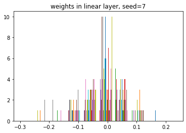

# Comparison between uncertainty and weights in linear layer


#### why we use a small precision: better contrast in visualization

 

######in high precision (e.g. 1000), every value is identical:

```
tensor([[0.0316, 0.0316, 0.0316,  ..., 0.0316, 0.0316, 0.0316],
        [0.0316, 0.0316, 0.0316,  ..., 0.0316, 0.0316, 0.0316],
        [0.0316, 0.0316, 0.0316,  ..., 0.0316, 0.0316, 0.0316],
        ...,
        [0.0316, 0.0316, 0.0316,  ..., 0.0316, 0.0316, 0.0316],
        [0.0316, 0.0316, 0.0316,  ..., 0.0316, 0.0316, 0.0316],
        [0.0316, 0.0316, 0.0316,  ..., 0.0316, 0.0316, 0.0316]])
```

```
mean standard deviation of layer 0.weight: 0.0316
mean standard deviation of layer 0.bias: 0.0316
mean standard deviation of layer 3.weight: 0.0316
mean standard deviation of layer 3.bias: 0.0316
mean standard deviation of layer 7.weight: 0.0316
mean standard deviation of layer 7.bias: 0.0316
```


#### Following comparisons are using precision 0.0001

------------------


####  seed=10


### histogram of the weights at interesting features (16, 19, 31)


--------------------------


#### seed=9


### histogram of the weights at interesting features (2, 9, 14, 15, 18, 25)


-------------------


#### seed=8


### histogram of the weights at interesting features (21)


--------------


#### seed = 7




### histogram of the weights at interesting features (6, 8, 15, 32)


-------------


#### seed = 6


### histogram of the weights at interesting features (20, 23, 31)


