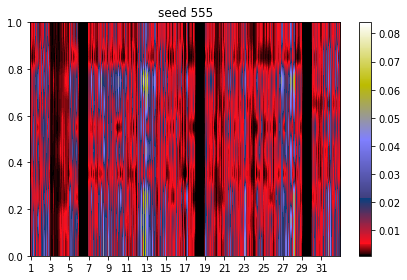

# The Network with different seeds

* therefore we use the same network and training procedure
* we use ten different seeds


### first we will compare the mean variances over the different seeds

###### we compare the means while using a precision of 120 and 1000. The single means are calculated with the function: (with seeds in order: 42, 9, 30, 19, 40, 98, 124, 1107, 555, 10)

```python
def meancalc2(Hessian_diag_x):
    i = 0 
    for name, parameter in mnist_model.named_parameters():
        mean = torch.mean(Hessian_diag_x[i])
        print("mean variance of layer {0:s}: {1:.4f}".format(name, mean.item()))
        i += 1
```

* ```python
  precision 120:
  mean variances of layer 0.weight: 0.0101; 0.0105; 0.0104; 0.0103; 0.0104; 0.0101; 0.0109; 0.0102; 0.0108; 0.0103
  mean variances of layer 0.bias: 0.0174; 0.0198; 0.0177; 0.0168; 0.0181; 0.0172; 0.0210; 0.0169; 0.0212; 0.0165
  mean variances of layer 3.weight: 0.0085; 0.0086; 0.0086; 0.0086; 0.0086; 0.0086; 0.0086; 0.0085; 0.0086; 0.0086
  mean variances of layer 3.bias: 0.0092; 0.0092; 0.0092; 0.0093; 0.0092; 0.0091; 0.0093; 0.0091; 0.0093; 0.0092
  mean variances of layer 7.weight: 0.0168; 0.0186; 0.0208; 0.0216; 0.0191; 0.0184; 0.0204; 0.0174; 0.0178; 0.0189
  mean variances of layer 7.bias: 0.0108; 0.0109; 0.0107; 0.0109; 0.0108; 0.0108; 0.0109; 0.0106; 0.0109; 0.0107
  ```


* ```python
  precision 1000:
  mean variance of layer 0.weight: 0.0028; 0.0032; 0.0030; 0.0030; 0.0030; 0.0028; 0.0035; 0.0028; 0.0035; 0.0030
  mean variance of layer 0.bias: 0.0100; 0.0125; 0.0103; 0.0095; 0.0108; 0.0099; 0.0137; 0.0096; 0.0138; 0.0092
  mean variance of layer 3.weight: 0.0012; 0.0012; 0.0012; 0.0013; 0.0013; 0.0012; 0.0013; 0.0012; 0.0012; 0.0012
  mean variance of layer 3.bias: 0.0019; 0.0019; 0.0019; 0.0019; 0.0019; 0.0018; 0.0019; 0.0018; 0.0020; 0.0018
  mean variance of layer 7.weight: 0.0095; 0.0113; 0.0134; 0.0142; 0.0117; 0.0111; 0.0131; 0.0101; 0.0105; 0.0115
  mean variance of layer 7.bias: 0.0034; 0.0036; 0.0034; 0.0036; 0.0035; 0.0034; 0.0036; 0.0032; 0.0036; 0.0034
  ```


### Visulization of the whole linear layer uncertainty (precision = 1000).

######this is done with the following code in python:

```python
plt.imshow(MNIST_NN_Hessian_diag_1000[4], cmap='gist_stern',extent=[0,512,0,1],  aspect='auto')
ax = plt.gca()
ax.set_xticks(np.arange(1, 512, 32));
ax.set_xticklabels(np.arange(1, 32, 2));
ax.set_title('seed {}'.format(s))
plt.colorbar()
plt.tight_layout()
plt.show()
```




